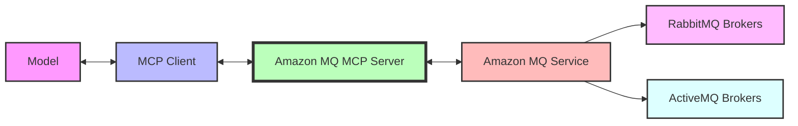

Amazon MQ 向けの Model Context Protocol (MCP) サーバーです。生成 AI モデルが MCP ツールを通じて RabbitMQ および ActiveMQ のメッセージブローカーを管理できるようにします。

## 機能 {#features}

この MCP サーバーは、MCP クライアントと Amazon MQ の間の **ブリッジ** として機能し、生成 AI モデルがメッセージブローカーを作成、構成、管理できるようにします。さらに、Amazon MQ for RabbitMQ ブローカーをブローカーレベルで管理するツールも提供します。このサーバーは、適切なアクセス制御とリソースのタグ付けを維持しながら、Amazon MQ リソースと安全にやり取りする方法を提供します。



**セキュリティ** の観点から、このサーバーはリソースのタグ付けを実装しており、MCP サーバーを通じて作成されたリソースのみをサーバーが変更できるようにしています。これにより、MCP サーバーが作成したものではない既存の Amazon MQ リソースへの不正な変更を防止します。

## 主な機能 {#key-capabilities}

- Amazon MQ ブローカー（RabbitMQ および ActiveMQ）の作成と管理
- ブローカーの設定とパラメータの構成
- 既存のブローカーの一覧表示と詳細確認
- ブローカーの再起動と更新
- ブローカー構成の作成と管理
- セキュリティのためのリソースの自動タグ付け

## 前提条件 {#prerequisites}

1. [Astral](https://docs.astral.sh/uv/getting-started/installation/) または [GitHub README](https://github.com/astral-sh/uv#installation) から `uv` をインストールします
2. `uv python install 3.10` を使用して Python をインストールします
3. Amazon MQ リソースを作成・管理する権限を持つ AWS アカウント

## セットアップ {#setup}

### IAM の設定 {#iam-configuration}

AmazonMQ MCP サーバーと AWS アカウントの間の認可は、ホスト上で設定した AWS プロファイルを使用して行われます。AWS プロファイルを設定する方法はいくつかありますが、「最小権限」の原則に従い、`AmazonMQReadOnlyAccess` 権限を持つ新しい IAM ロールを作成することをお勧めします。なお、タグ付けされたリソースを変更するツールを使用したい場合は、`AmazonMQFullAccess` を付与する必要があります。最後に、その新しいロールを引き受ける AWS プロファイルをホスト上で設定します（詳細については [AWS CLI ヘルプページ](https://docs.aws.amazon.com/cli/v1/userguide/cli-configure-role.html) を参照してください）。

### インストール {#installation}

| Kiro | Cursor | VS Code |
|:----:|:------:|:-------:|
| [](https://kiro.dev/launch/mcp/add?name=awslabs.amazon-mq-mcp-server&config=%7B%22command%22%3A%22uvx%22%2C%22args%22%3A%5B%22awslabs.amazon-mq-mcp-server%40latest%22%5D%2C%22env%22%3A%7B%22AWS_PROFILE%22%3A%22your-aws-profile%22%2C%22AWS_REGION%22%3A%22us-east-1%22%2C%22FASTMCP_LOG_LEVEL%22%3A%22ERROR%22%7D%7D) | [](https://cursor.com/en/install-mcp?name=awslabs.amazon-mq-mcp-server&config=eyJjb21tYW5kIjoidXZ4IGF3c2xhYnMuYW1hem9uLW1xLW1jcC1zZXJ2ZXJAbGF0ZXN0IiwiZW52Ijp7IkFXU19QUk9GSUxFIjoieW91ci1hd3MtcHJvZmlsZSIsIkFXU19SRUdJT04iOiJ1cy1lYXN0LTEiLCJGQVNUTUNQX0xPR19MRVZFTCI6IkVSUk9SIn0sImRpc2FibGVkIjpmYWxzZSwiYXV0b0FwcHJvdmUiOltdfQ%3D%3D) | [](https://insiders.vscode.dev/redirect/mcp/install?name=Amazon%20MQ%20MCP%20Server&config=%7B%22command%22%3A%22uvx%22%2C%22args%22%3A%5B%22awslabs.amazon-mq-mcp-server%40latest%22%5D%2C%22env%22%3A%7B%22AWS_PROFILE%22%3A%22your-aws-profile%22%2C%22AWS_REGION%22%3A%22us-east-1%22%2C%22FASTMCP_LOG_LEVEL%22%3A%22ERROR%22%7D%2C%22disabled%22%3Afalse%2C%22autoApprove%22%3A%5B%5D%7D) |

#### Kiro {#kiro}

MCP クライアントの設定ファイルで MCP サーバーを構成します（例: Kiro の場合は `~/.kiro/settings/mcp.json` を編集します）。

```json
{
  "mcpServers": {
    "awslabs.amazon-mq-mcp-server": {
      "command": "uvx",
      "args": ["awslabs.amazon-mq-mcp-server@latest"],
      "env": {
        "AWS_PROFILE": "your-aws-profile",
        "AWS_REGION": "us-east-1"
      }
    }
  }
}
```
### Windows でのインストール {#windows-installation}

Windows ユーザーの場合、MCP サーバーの設定形式は少し異なります。

```json
{
  "mcpServers": {
    "awslabs.amazon-mq-mcp-server": {
      "disabled": false,
      "timeout": 60,
      "type": "stdio",
      "command": "uv",
      "args": [
        "tool",
        "run",
        "--from",
        "awslabs.amazon-mq-mcp-server@latest",
        "awslabs.amazon-mq-mcp-server.exe"
      ],
      "env": {
        "FASTMCP_LOG_LEVEL": "ERROR",
        "AWS_PROFILE": "your-aws-profile",
        "AWS_REGION": "us-east-1"
      }
    }
  }
}
```


フラグを指定したい場合（例えばリソースの作成を許可する場合）は、args に渡すことができます。

```json
{
  "mcpServers": {
    "awslabs.amazon-mq-mcp-server": {
      "command": "uvx",
      "args": ["awslabs.amazon-mq-mcp-server@latest", "--allow-resource-creation"],
      "env": {
        "AWS_PROFILE": "your-aws-profile",
        "AWS_REGION": "us-east-1"
      }
    }
  }
}
```

#### Docker {#docker}
まず、イメージをビルドします `docker build -t awslabs/amazon-mq-mcp-server .`:

```file
# fictitious `.env` file with AWS temporary credentials
AWS_ACCESS_KEY_ID=<from the profile you set up>
AWS_SECRET_ACCESS_KEY=<from the profile you set up>
AWS_SESSION_TOKEN=<from the profile you set up>
```

```json
  {
    "mcpServers": {
      "awslabs.amazon-mq-mcp-server": {
        "command": "docker",
        "args": [
          "run",
          "--rm",
          "--interactive",
          "--env-file",
          "/full/path/to/file/above/.env",
          "awslabs/amazon-mq-mcp-server:latest"
        ],
        "env": {},
        "disabled": false,
        "autoApprove": []
      }
    }
  }
```

public.ecr.aws/awslabs-mcp/awslabs/amazon-mq-mcp-server:latest にあるパブリック ECR イメージをプルすることもできます。

#### Kiro {#kiro-1}

プロジェクトレベルの `.kiro/settings/mcp.json` に設定します。

```json
{
  "mcpServers": {
    "awslabs.amazon-mq-mcp-server": {
      "command": "uvx",
      "args": ["awslabs.amazon-mq-mcp-server@latest"],
      "env": {
        "AWS_PROFILE": "your-aws-profile",
        "AWS_REGION": "us-east-1"
      }
    }
  }
}
```

#### Claude Desktop {#claude-desktop}

```json
{
  "mcpServers": {
    "awslabs.amazon-mq-mcp-server": {
      "command": "uvx",
      "args": ["awslabs.amazon-mq-mcp-server@latest"],
      "env": {
        "AWS_PROFILE": "your-aws-profile",
        "AWS_REGION": "us-east-1"
      }
    }
  }
}
```

## サーバー設定オプション {#server-configuration-options}

Amazon MQ MCP サーバーは、その動作を構成するために使用できるいくつかのコマンドライン引数をサポートしています。

### `--allow-resource-creation` {#--allow-resource-creation}

ユーザーの AWS アカウント内にリソースを作成するツールを許可します。このフラグを有効にすると、`create_broker` および `create_configuration` ツールが MCP クライアント向けに作成され、新しい Amazon MQ リソースの作成を防止します。デフォルトは False です。

このフラグは特に次のような場合に役立ちます。
- リソースの作成を制限すべきテスト環境
- AI モデルが利用できるアクションの範囲を制限する場合

例:
```bash
uv run awslabs.amazon-mq-mcp-server --allow-resource-creation
```

### セキュリティ機能 {#security-features}

MCP サーバーは、MCP サーバー自身が作成したリソースのみの変更を許可するセキュリティメカニズムを実装しています。これは次の方法によって実現されます。

1. 作成されたすべてのリソースに `mcp_server_version` タグを自動的に付与する
2. 変更を伴うアクション（更新、削除、再起動）を許可する前にこのタグを検証する
3. 適切なタグを持たないリソースに対する操作を拒否する

## ベストプラクティス {#best-practices}

- リソースを簡単に識別できるように、わかりやすいブローカー名を使用する
- IAM 権限を設定する際は最小権限の原則に従う
- 環境ごと（dev、test、prod）に別々の AWS プロファイルを使用する
- パフォーマンスや問題を把握するためにブローカーのメトリクスとログを監視する
- クライアントアプリケーションで適切なエラーハンドリングを実装する

## セキュリティに関する考慮事項 {#security-considerations}

この MCP サーバーを使用する際は、次の点を考慮してください。

- MCP サーバーには、Amazon MQ リソースを作成・管理する権限が必要です
- MCP サーバーが作成したリソースのみをサーバーが変更できます
- ブローカーに適切なネットワークセキュリティを確保してください（可能な場合は `publicly_accessible: false` を使用してください）
- ブローカーユーザーには強力な認証を実装してください
- 認証情報を定期的に確認・ローテーションしてください

## トラブルシューティング {#troubleshooting}

- 権限エラーが発生した場合は、IAM ユーザーに正しいポリシーがアタッチされているか確認してください
- 接続の問題が発生した場合は、ネットワーク構成とセキュリティグループを確認してください
- リソースの変更がタグ検証エラーで失敗する場合は、そのリソースが MCP サーバーによって作成されたものではないことを意味します
- Amazon MQ に関する一般的な問題については、[Amazon MQ ドキュメント](https://docs.aws.amazon.com/amazon-mq/) を参照してください
