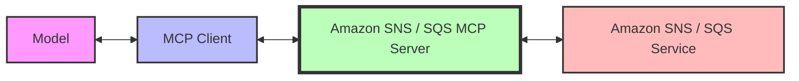

生成 AI モデルが MCP ツールを通じて SNS トピックと SQS キューを管理できるようにする、Amazon SNS / SQS 向けの Model Context Protocol (MCP) サーバーです。

## 機能 {#features}

この MCP サーバーは、MCP クライアントと Amazon SNS / SQS の間の**ブリッジ**として機能し、生成 AI モデルがトピック / キューを作成、設定、管理できるようにします。このサーバーは、適切なアクセス制御とリソースのタグ付けを維持しながら、Amazon SNS / SQS リソースとやり取りする安全な方法を提供します。



**セキュリティ**の観点から、このサーバーはリソースのタグ付けを実装しており、MCP サーバーを通じて作成されたリソースのみをサーバーが変更できるようにしています。これにより、MCP サーバーによって作成されたものではない既存の Amazon SNS/SQS リソースへの不正な変更を防止します。

## 主な機能 {#key-capabilities}

この MCP サーバーは、以下のツールを提供します。
- Amazon SNS トピックの作成、一覧表示、管理
- Amazon SNS サブスクリプションの作成、一覧表示、管理
- Amazon SQS キューの作成、一覧表示、管理
- SNS および SQS を使用したメッセージの送受信

## 前提条件 {#prerequisites}

1. [Astral](https://docs.astral.sh/uv/getting-started/installation/) または [GitHub README](https://github.com/astral-sh/uv#installation) から `uv` をインストールする
2. `uv python install 3.10` を使用して Python をインストールする
3. Amazon SNS / SQS リソースを作成および管理する権限を持つ AWS アカウント

## セットアップ {#setup}

### IAM 設定 {#iam-configuration}

MCP サーバーと AWS アカウントの間の認可は、ホスト上で設定した AWS プロファイルを使用して行われます。AWS プロファイルを設定する方法はいくつかありますが、「最小権限」の原則に従って、`AmazonSQSReadOnlyAccess` と `AmazonSNSReadOnlyAccess` の権限を持つ新しい IAM ロールを作成することを推奨します。なお、タグ付けされたリソースを変更するツールを使用したい場合は、`AmazonSNSFullAccess` と `AmazonSQSFullAccess` を付与する必要があります。最後に、その新しいロールを引き受ける AWS プロファイルをホスト上に設定します（詳細については、[AWS CLI ヘルプページ](https://docs.aws.amazon.com/cli/v1/userguide/cli-configure-role.html) を参照してください）。

### インストール {#installation}

| Kiro | Cursor | VS Code |
|:----:|:------:|:-------:|
| [](https://kiro.dev/launch/mcp/add?name=awslabs.amazon-sns-sqs-mcp-server&config=%7B%22command%22%3A%22uvx%22%2C%22args%22%3A%5B%22awslabs.amazon-sns-sqs-mcp-server%40latest%22%5D%2C%22env%22%3A%7B%22AWS_PROFILE%22%3A%22your-aws-profile%22%2C%22AWS_REGION%22%3A%22us-east-1%22%7D%7D) | [](https://cursor.com/en/install-mcp?name=awslabs.amazon-sns-sqs-mcp-server&config=eyJjb21tYW5kIjoidXZ4IGF3c2xhYnMuYW1hem9uLXNucy1zcXMtbWNwLXNlcnZlckBsYXRlc3QiLCJlbnYiOnsiQVdTX1BST0ZJTEUiOiJ5b3VyLWF3cy1wcm9maWxlIiwiQVdTX1JFR0lPTiI6InVzLWVhc3QtMSJ9fQ%3D%3D) | [](https://insiders.vscode.dev/redirect/mcp/install?name=Amazon%20SNS%2FSQS%20MCP%20Server&config=%7B%22command%22%3A%22uvx%22%2C%22args%22%3A%5B%22awslabs.amazon-sns-sqs-mcp-server%40latest%22%5D%2C%22env%22%3A%7B%22AWS_PROFILE%22%3A%22your-aws-profile%22%2C%22AWS_REGION%22%3A%22us-east-1%22%7D%7D) |

MCP サーバーを MCP クライアントの設定に追加します（例えば Kiro の場合は `~/.kiro/settings/mcp.json` を編集します）。

```json
{
  "mcpServers": {
    "awslabs.amazon-sns-sqs-mcp-server": {
      "command": "uvx",
      "args": ["awslabs.amazon-sns-sqs-mcp-server@latest"],
      "env": {
        "AWS_PROFILE": "your-aws-profile",
        "AWS_REGION": "us-east-1"
      }
    }
  }
}
```
### Windows でのインストール {#windows-installation}

Windows ユーザーの場合、MCP サーバーの設定形式は少し異なります。

```json
{
  "mcpServers": {
    "awslabs.amazon-sns-sqs-mcp-server": {
      "disabled": false,
      "timeout": 60,
      "type": "stdio",
      "command": "uv",
      "args": [
        "tool",
        "run",
        "--from",
        "awslabs.amazon-sns-sqs-mcp-server@latest",
        "awslabs.amazon-sns-sqs-mcp-server.exe"
      ],
      "env": {
        "FASTMCP_LOG_LEVEL": "ERROR",
        "AWS_PROFILE": "your-aws-profile",
        "AWS_REGION": "us-east-1"
      }
    }
  }
}
```


または `docker build -t awslabs/amazon-sns-sqs-mcp-server.` の成功後に docker を使用します。

```file
# fictitious `.env` file with AWS temporary credentials
AWS_ACCESS_KEY_ID=<from the profile you set up>
AWS_SECRET_ACCESS_KEY=<from the profile you set up>
AWS_SESSION_TOKEN=<from the profile you set up>
```

```json
  {
    "mcpServers": {
      "awslabs.sns-sqs-mcp-server": {
        "command": "docker",
        "args": [
          "run",
          "--rm",
          "--interactive",
          "--env-file",
          "/full/path/to/file/above/.env",
          "awslabs/amazon-sns-sqs-mcp-server:latest"
        ],
        "env": {},
        "disabled": false,
        "autoApprove": []
      }
    }
  }
```
## サーバー設定オプション {#server-configuration-options}

Amazon SNS / SQS MCP サーバーは、その動作を設定するために使用できるいくつかのコマンドライン引数をサポートしています。

### `--allow-resource-creation` {#--allow-resource-creation}

ユーザーの AWS アカウントにリソースを作成するツールを有効にします。このフラグが有効になっていない場合、新規リソース作成ツールは MCP クライアントから非表示になり、新しい Amazon SNS / SQS リソースの作成が防止されます。また、現在はトピック / キューの削除も防止します。デフォルトは False です。

このフラグは特に以下の用途に役立ちます。
- リソースの作成を制限すべきテスト環境
- AI モデルが利用できるアクションの範囲を制限する場合

例:
```bash
uv run awslabs.amazon-sns-sqs-mcp-server --disallow-resource-creation
```

### セキュリティ機能 {#security-features}

MCP サーバーは、MCP サーバー自体によって作成されたリソースのみの変更を許可するセキュリティメカニズムを実装しています。これは以下によって実現されます。

1. 作成されたすべてのリソースに `mcp_server_version` タグを自動的に付与する
2. 変更を伴うアクション（更新、削除）を許可する前にこのタグを検証する。これは、MCP サーバーによって作成されたリソースのみが変更可能であることを保証する決定論的なチェックです
3. 適切なタグを持たないリソースに対する操作を拒否する
4. [Application-to-Person](https://docs.aws.amazon.com/sns/latest/dg/sns-user-notifications.html) (A2P) メッセージングの変更を伴う操作は、セキュリティ上の理由からデフォルトでは有効になっていません

## ベストプラクティス {#best-practices}

- リソースを容易に識別できるように、わかりやすいトピック名とキュー名を使用する
- IAM 権限を設定する際は最小権限の原則に従う
- 環境（開発、テスト、本番）ごとに別々の AWS プロファイルを使用する
- クライアントアプリケーションで適切なエラーハンドリングを実装する

## セキュリティに関する考慮事項 {#security-considerations}

この MCP サーバーを使用する際は、以下を考慮してください。

- MCP サーバーには、Amazon SNS / SQS リソースを作成および管理する権限が必要です
- リソースはタグ付けされているため、MCP サーバーによって作成されたリソースのみをサーバーが変更できます
- リソースの作成はデフォルトで無効になっており、`--allow-resource-creation` フラグを有効にすることで有効化できます


## トラブルシューティング {#troubleshooting}

- 権限エラーが発生した場合は、IAM ユーザーに正しいポリシーがアタッチされているか確認してください
- 接続の問題が発生した場合は、ネットワーク設定とセキュリティグループを確認してください
- タグ検証エラーでリソースの変更に失敗した場合、そのリソースは MCP サーバーによって作成されたものではないことを意味します
- Amazon SNS / SQS 全般の問題については、[Amazon SNS ドキュメント](https://docs.aws.amazon.com/sns/) および [Amazon SQS ドキュメント](https://docs.aws.amazon.com/sqs/) を参照してください

## バージョン {#version}

現在の MCP サーバーバージョン: 1.0.0
