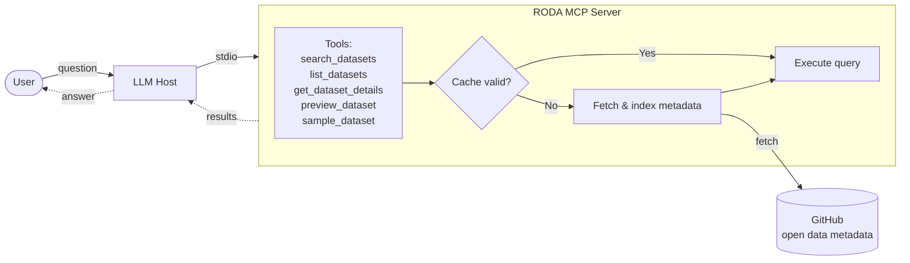

# High-level Architecture

Open data providers onboard new datasets and provide updates to existing datasets using a structured YAML schema for dataset metadata (see example [here](https://github.com/awslabs/open-data-registry)). The YAML schema includes keys such as name, description, tags (a list of relevant topics), managedBy (provider organization), update frequency and resources (as part of access instructions). Every time an update is made (such as adding or updating data) in the Registry, an automated build is run to generate a parsed metadata file in ndjson format.

This MCP server uses this ndjson file to build an in-memory knowledge base. In particular, we build indexes for parsed data across different search categories, such as tags, keywords, and organizations, to provide fast and accurate retrieval of information based on the dataset’s metadata. Metadata information is cached for 24 hours for better performance, and the cache automatically refreshes after expiration.

For detailed design, check of this [drawio file](architecture.drawio).
